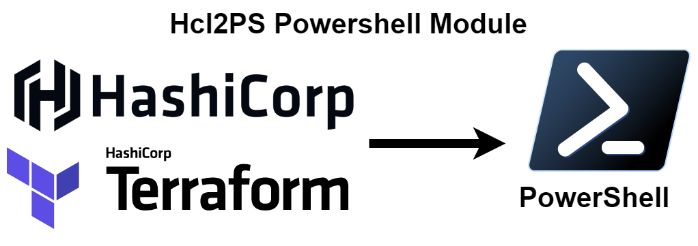

[](https://github.com/MertSenel/Hcl2PS/actions/workflows/ci.yml) [](https://github.com/MertSenel/Hcl2PS/actions/workflows/publish-module.yml) [](https://opensource.org/licenses/Apache-2.0)

# Hcl2PS

PowerShell Module to Wrap Hcl2Json CLI tool for Easy distribution of PowerShell cmdlets to Parse HCL Files

Thanks to @tmccombs for the original CLI tool, you can see the original code of the CLI tool in below urls.

hcl2Json Project Url: [https://github.com/tmccombs/hcl2json](https://github.com/tmccombs/hcl2json)

hcl2Json Project License: [https://github.com/tmccombs/hcl2json/blob/main/LICENSE](https://github.com/tmccombs/hcl2json/blob/main/LICENSE)

## Installation

`Hcl2PS` is aimed to be cross-platform and tested with best effort on Windows, Linux, and MacOS.

Getting started with `Hcl2PS` is easy. Simply install the module from the gallery using the following command: 

```powershell
Install-Module -Name Hcl2PS
```

## Usage

The cmdlet `ConvertFrom-Hcl` accepts input in two ways, you can either pass a filepath to the Hcl file you wish to convert to a terraform object, or you can pass the contents of the file via pipeline input. 

`ConvertFrom-Hcl -Path .\main.tf`

`Get-Content .\main.tf -Raw | ConvertFrom-Hcl`

As an output, the Cmdlet will return a Powershell object which has the properties mapped from the HCL syntax file's contents.

### Example


## Contributions & Issues

Contributions are welcomed, please raise a Pull Request with your proposed modifications if you wish to make any changes.
If you find an Issue and wish to report it, please use the Issues section.

## License

Apache Licensed, please see [license](LICENSE.txt) for details.

